## Hi there 👋 I am a web engineer, and hands on!

I like challenges and explore new horizons, because only then I can truely transform the world for better!
Please check something tangible I've crafted!

### About me
- 🔭 Take a look at the [React Datepicker](https://github.com/WebCrazy003/react-datetime-picker) I've built!
- 📫 When everything else gets dull, I like to dive into solving [algorithms](https://github.com/WebCrazy003/algorithm-and-data-structure) to find my inner zen!
- 💬 I'm really into playing around with canvas stuff using p5! You can check out my tinkering [here](https://github.com/WebCrazy003/p5-canvas)!  
- 🌱 Presently, I'm enhancing my skills in Python and AWS.
- ⚡ Fun fact: I'm a travel enthusiast who enjoys weekend hikes.

### Something I've crafted recently ✨ !
- The proudest custom React component
  * [Autocomplete](https://gist.github.com/WebCrazy003/b731ca10ea017feca8e8756da859bd69)
  * [useForm hook](https://gist.github.com/WebCrazy003/0a07b92d91fdf4c0e48ccdae734f12c8)
- Some test code(Unit test)
  * [Controller test](https://gist.github.com/WebCrazy003/79e64945c5644f658d8fb7950325e4eb)
  * [Function test](https://gist.github.com/WebCrazy003/c29a5d8fae2377bb6ba3f58a162d8764)
  * [Service test](https://gist.github.com/WebCrazy003/7f8266b307475b4db0832d64d392bf94)

### Something I like to use in my development!
- [Airbnb](https://github.com/airbnb/javascript) JavaScript Style Guide
   Some rules I used to override
  * [simple-import-sort](https://github.com/lydell/eslint-plugin-simple-import-sort#readme)
  * import/newline-after-import
  * sort-imports
  * [@typescript-eslint/prefer-as-const](https://github.com/typescript-eslint/typescript-eslint/blob/HEAD/packages/eslint-plugin/docs/rules/prefer-as-const.md)
  * @typescript-eslint/no-unused-vars
  * react/jsx-no-useless-fragment
- The most used UI library : Antd
- I love React, but I've also got some history with Angular, my old buddy 😄

<!--
### Github Profile Trophy

-->

Let's engage in a conversation about your business requirements and the technical solutions I can offer!

<!--
**WebCrazy003/webcrazy003** is a ✨ _special_ ✨ repository because its `README.md` (this file) appears on your GitHub profile.

Here are some ideas to get you started:

- 🔭 I’m currently working on ...
- 🌱 I’m currently learning ...
- 👯 I’m looking to collaborate on ...
- 🤔 I’m looking for help with ...
- 💬 Ask me about ...
- 📫 How to reach me: ...
- 😄 Pronouns: ...
- ⚡ Fun fact: ...
-->
